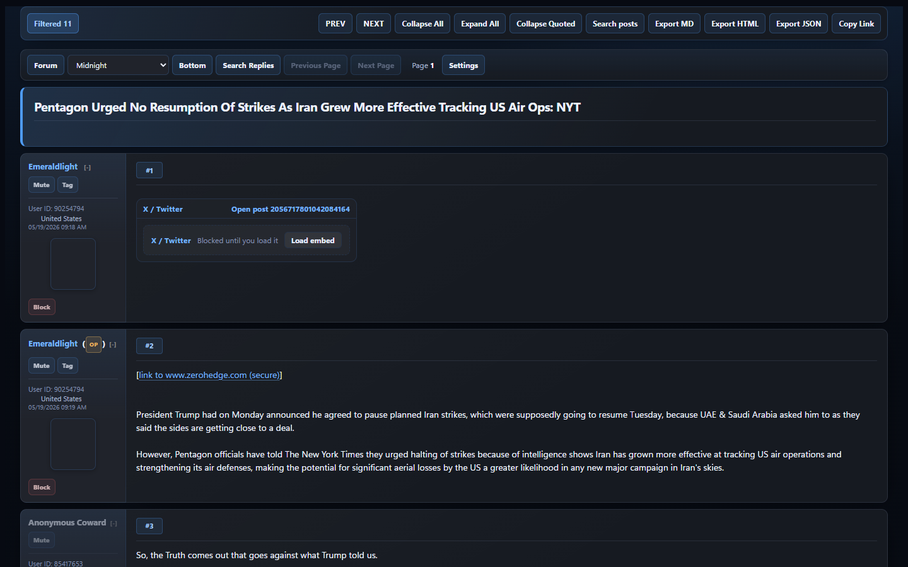
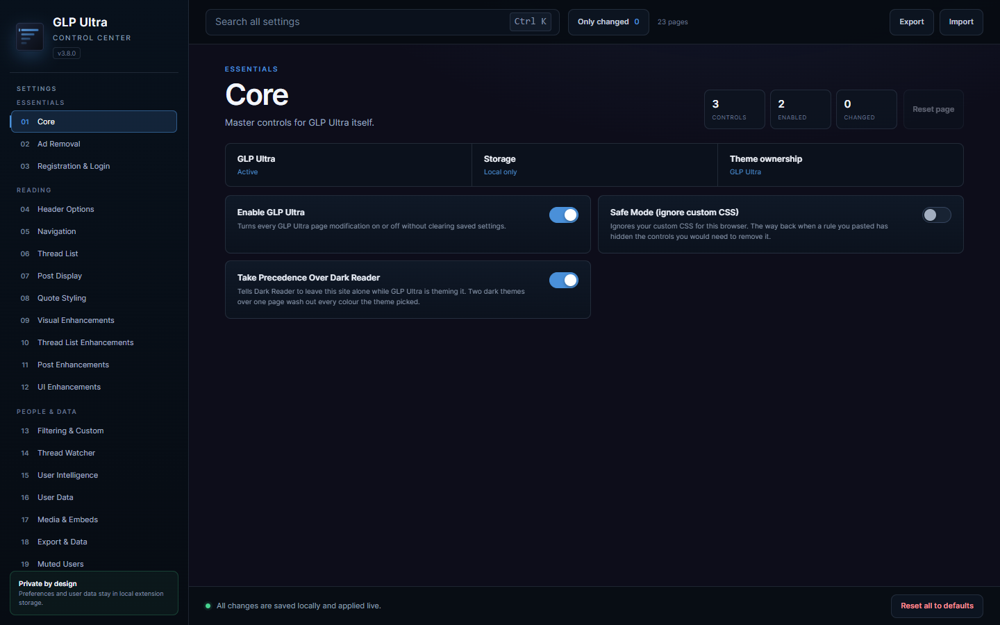
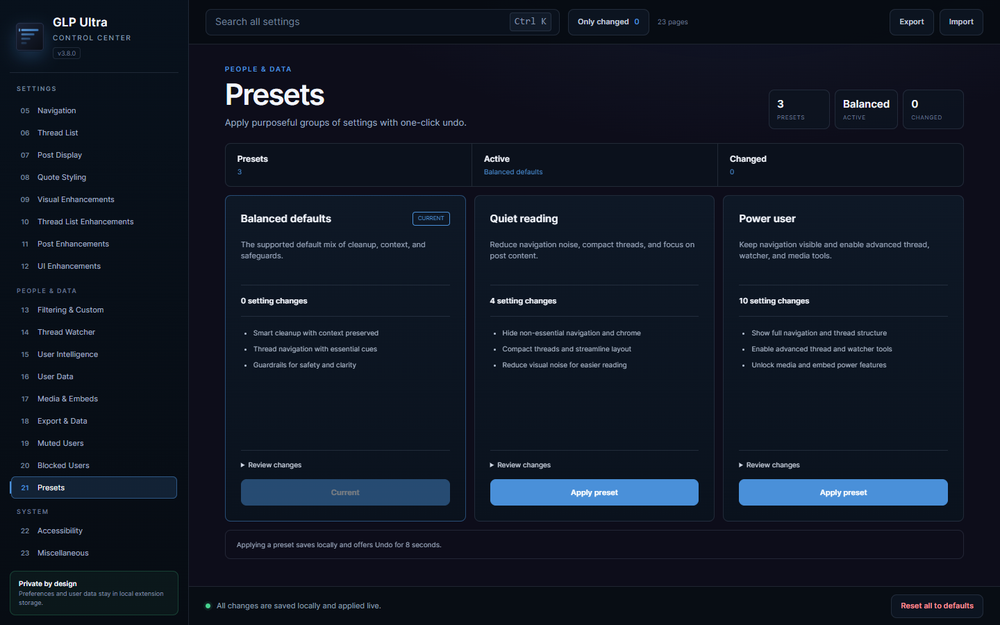

# GLP Ultra

[](https://github.com/SysAdminDoc/GLP-Ultra/releases/tag/v3.8.3)
[](LICENSE)
[](#install)
[](extension/manifest.json)

GLP Ultra turns [Godlike Productions](https://www.godlikeproductions.com/) into a clearer reading experience. It adds responsive dark themes, structured thread cards, local filtering and moderation controls, plus portable thread exports. Chrome, Edge, Firefox, and userscript builds all come from the same source.

Everything runs locally. GLP Ultra loads no remote code, analytics, fonts, or JavaScript libraries.

[Download the latest release](https://github.com/SysAdminDoc/GLP-Ultra/releases/latest)

## What it does

**141 settings across 23 routed pages**, all searchable from the in-page control center or the extension options page.

| Area | Highlights |
| --- | --- |
| Ads & nags | precise MGID/widget/AMP removal, extension-only network blocking via `declarativeNetRequest`, registration-nag bypass, and no automation of membership contracts or consent |
| Chrome | header, nav, tab-bar, footer, and layout-spacer cleanup; compact and sticky modes |
| Thread list | column control, sort toolbar (updated/posted/rating/views/replies, both directions), newest-first default, pinned-thread hide or highlight, freshness colors, hot-thread badges, hide-thread buttons, keyword filters, infinite scroll, auto-refresh, hover previews |
| Posts | compact/wider layouts, reader mode, OP highlighting, post numbers and permalinks, relative timestamps, collapsible posts, quote depth badges, nested-quote collapse, YouTube embedding, image lightbox with gallery navigation, in-thread quick search |
| Moderation | mute users by name, block users by numeric user ID, hide image-only replies, hide `/sm/` reaction GIFs, per-user tags, hidden-thread manager |
| Look | 10 dark themes, corner style, font size, line height, max width, custom CSS (scoped) |
| Watcher | watch threads, unread-delta digest with last-checked age and failed-check state, hidden-tab pause, toolbar badge, MV3 background alarms |
| Export | thread to Markdown / HTML / JSON with a media manifest, copy thread link, full data backup and restore |
| Recovery | one shelf listing hidden threads, muted and blocked users, and active filters, each restorable on its own |
| Diagnostics | route, active features, per-feature worst-run timings, fetch queue state, selector health with drift warnings, and a local issue-bundle export |
| Quote graph | who answered a post, inferred from the site's own "Quoting:" links. Backlink chips add hover excerpts and in-page jumps |
| Noise budget | a running count of what is being kept off the page, with a breakdown and a route to restore any of it |
| Media | Save / Open / Copy link on post images, click-to-load third-party embeds, lightbox and gallery |
| Accessibility | reduce motion, high contrast, and larger click targets. These rules are emitted last so they beat the theme |
| Portability | validated format-3 backup and restore for every local store, safe theme/filter packs, optional settings sync across devices |

Every feature exposes `init`/`apply`/`destroy`, tracks its owned listeners and observers, and unwinds itself completely when switched off. Errors in one feature can no longer take the rest of the page down with them.

## Forum reading surface

Thread pages use a wide message column, a compact author rail, and individual post cards with
clear quote layers. The forum feed uses matching card rows with readable metadata. Toolbars wrap
into touch-friendly rows on narrow screens instead of covering posts or forcing horizontal scroll.



## Settings control center

The desktop control center exposes one focused page per job, with search, truthful saved/changed
state, dependent-control feedback, page and per-setting reset with undo, operational presets,
local-list management, data recovery, diagnostics, and keyboard navigation.





The Diagnostics panel's **Save report** action creates a local JSON issue bundle containing the
current route, browser context, settings, local lists, selector health, feature errors, timings,
and fetch-queue state. Review it before sharing: it may contain your forum URL and private local
mute, block, tag, and hidden-thread data.

## Install

### Chrome, Edge, and Brave

1. Download [glp-ultra-v3.8.3.zip](https://github.com/SysAdminDoc/GLP-Ultra/releases/download/v3.8.3/glp-ultra-v3.8.3.zip).
2. Extract it to a permanent folder.
3. Open the browser's extensions page and turn on **Developer mode**.
4. Choose **Load unpacked**, then select the extracted folder.

The source checkout is also ready to load from `extension/`. Run `npm run load` to copy that path
and open `chrome://extensions`. After changing `src/glp-ultra.user.js`, run `npm run build` and
reload the extension card.

### Firefox

Download [glp-ultra-firefox-v3.8.3.zip](https://github.com/SysAdminDoc/GLP-Ultra/releases/download/v3.8.3/glp-ultra-firefox-v3.8.3.zip), extract it, then load `manifest.json` through `about:debugging` > **This Firefox** > **Load Temporary Add-on**.

Everything but the manifest is identical to the Chrome build. The Gecko variant swaps the
service-worker background for an event page, and adds the extension id and `strict_min_version`
Firefox requires.

Firefox treats host permissions as opt-in: the content scripts register regardless, but the
network-level ad blocking stays inert until the host permission is granted from the add-on's
permissions tab. The variant is gated structurally by `npm run verify:extension`. The runtime
test runner drives Chromium only, so Firefox behaviour is not machine-verified.

### Userscript

Install [glp-ultra.user.js](https://github.com/SysAdminDoc/GLP-Ultra/releases/download/v3.8.3/glp-ultra.user.js) in Tampermonkey or Violentmonkey. It uses the same engine and settings panel. The popup, options page, and network-level ad blocking remain extension-only.

Both distributions run only in the top-level page. The userscript declares `@noframes` and also
checks the runtime frame, matching the extension's explicit top-frame-only content-script policy.
Theme packs never carry Custom CSS; complete backups do, and every imported setting and local-data
family is validated before it reaches storage or the page.

The generated userscript metadata includes GitHub Raw `@updateURL` and `@downloadURL` entries, so
Tampermonkey or Violentmonkey can check for updates from the `main` build. The small
`dist/glp-ultra.meta.js` file is also suitable for managers that request metadata separately.

## Layout

```
src/glp-ultra.user.js        Engine. This is the single source of truth
extension/
  manifest.json              MV3, document_start content scripts
  content/gm-shim.js         GM_* -> localStorage, mirrored to chrome.storage
  content/glp-ultra.user.js  Built from src/ (do not edit)
  content/ext-bridge.js      Messaging bridge for popup/options/service worker
  background/                Service worker: context menus, DNR toggle, badge, watcher alarms
  popup/ options/            Extension UI (options page generated from the engine schema)
  rules/ad-network.json      declarativeNetRequest rules, scoped to GLP
  generated/                 settings-schema.js (build output)
captures/*.mhtml             Real GLP pages used for offline verification
scripts/                     build, icons, package, verification gates
```

## Commands

| Command | Purpose |
| --- | --- |
| `npm run check` | Syntax + policy + lifecycle gates (no remote code, no confirm dialogs, schema coverage, teardown/queue/observer checks) |
| `npm run load` | Copies the extension path and opens `chrome://extensions` |
| `npm run build` | Emits `dist/`, `extension/content/glp-ultra.user.js`, and the options-page schema |
| `npm run verify:captures` | Asserts the selector registry still matches real captured GLP pages |
| `npm run verify:extension` | Manifest/file/version/rule integrity, both browser variants |
| `npm run verify:options` | Drives all 23 options routes, state transitions, recovery actions, and both supported desktop viewports |
| `npm run verify:runtime` | Loads the unpacked extension in Chromium and drives it against the real captures |
| `npm run verify` | All of the above |
| `npm run shots` | Screenshots every surface in every theme into `dist/ui-shots/` |
| `npm run shots:pages` | Routes and screenshots all 23 control-center pages in Midnight into `dist/ui-pages/` |
| `npm run icons` | Regenerates PNG icons from `assets/icon.svg` |
| `npm run build:firefox` | Generates `dist/extension-firefox/` |
| `npm run package` | Deterministic `dist/glp-ultra-v<version>.zip` |
| `npm run package:firefox` | Deterministic `dist/glp-ultra-firefox-v<version>.zip` |

The build fails if a setting exists without a home in the panel, so the options page can never drift from the engine.

## License

MIT. See [LICENSE](LICENSE).
